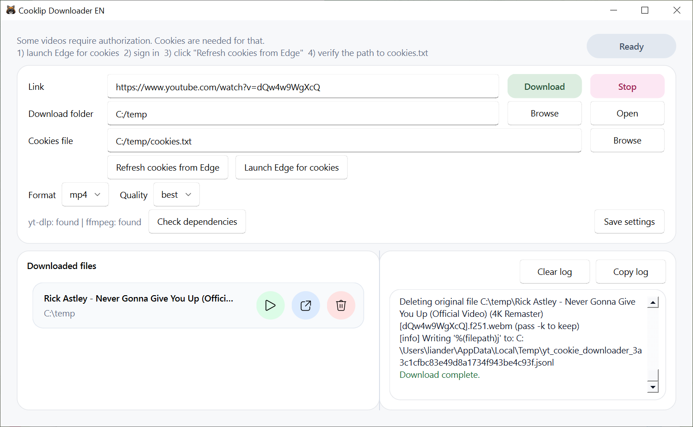

# Cooklip Downloader

Cooklip Downloader is a desktop GUI for `yt-dlp` with Microsoft Edge cookie support. It can download video, audio, or playlists from YouTube, Twitch, TikTok, and many other platforms supported by `yt-dlp`.

## Features

- download video or audio from a link
- download playlists
- refresh `cookies.txt` from Microsoft Edge
- choose format and quality
- create compatible MP4 files with H.264/AAC for better playback and editing support
- keep a history of downloaded files
- portable `data/` folder next to the app
- English default GUI and separate Russian GUI versions
- built with Python, PySide6, QFluentWidgets, `yt-dlp`, and `ffmpeg`

## Interface

## Project Files

- `cooklip_core.py` - English core logic
- `cooklip_gui.py` - English GUI
- `cooklip_core_ru.py` - Russian core logic
- `cooklip_gui_ru.py` - Russian GUI
- `cooklip_resources.qrc` - Qt resource definition
- `cooklip_resources_rc.py` - generated Qt resource module
- `cooklip.ico` - application icon
- `build_cooklip.ps1` - build script for all release variants

## Release Variants

### Lite

- includes the app executable
- includes `yt-dlp.exe`
- includes `deno.exe`
- does not include `ffmpeg`

### Full

- includes the app executable
- includes `yt-dlp.exe`
- includes `deno.exe`
- includes `ffmpeg.exe`
- includes `ffprobe.exe`

## Portable Data

Cooklip stores user files next to the app in a `data` folder:

- settings: `data/cooklip_settings.json`
- cookies: `data/cookies.txt`

This keeps the app portable and makes cookies easy to find and replace.

## YouTube Notes

Some YouTube videos may require `deno` for challenge solving when `yt-dlp` needs an external JavaScript runtime. The packaged Cooklip Lite and Full releases include `deno.exe` in `bin/`.

## Build

See `BUILD_COOKLIP.md` for build instructions.

